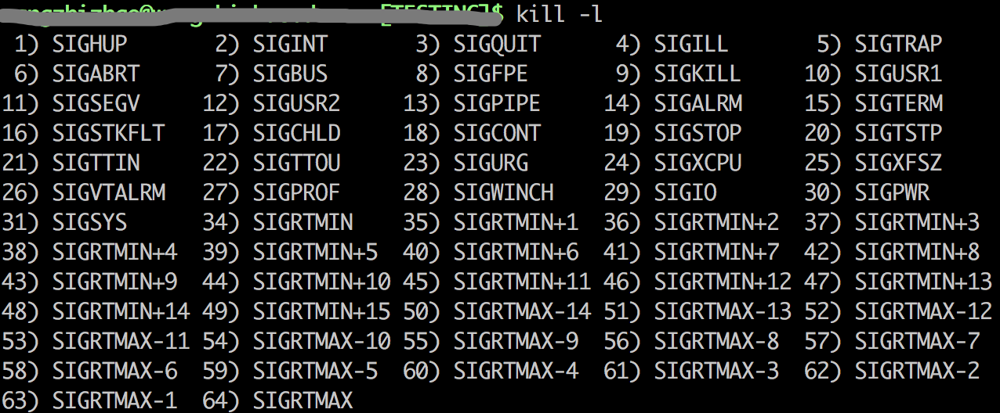

linux kill 命令
=============

kill 命令用于终止一个进程

## kill 语法
`kill [信号或选项] PID(s)`

## kill -l
查看所有信号:

## kill -9 vs kill -15
- SIGTERM(15) - 此信号请求一个进程停止运行。此信号是可以被忽略的。进程可以用一段时间来正常关闭，一个程序的正常关闭一般需要一段时间来保存进度并释放资源。换句话说，它不是强制停止。
- SIGKILL(9) - 此信号强制进程立刻停止运行。程序不能忽略此信号，而未保存的进度将会丢失。

## kill 常用信号
### SIGHUP
本信号在用户终端连接(正常或非正常)结束时发出, 通常是在终端的控制进程结束时, 通知同一session内的各个作业, 这时它们与控制终端不再关联。

### SIGINT
程序终止(interrupt)信号, 在用户键入 INTR 字符(通常是 `Ctrl+C` )时发出，用于通知前台进程组终止进程。

### SIGQUIT
和SIGINT类似, 但由QUIT字符(通常是 `Ctrl+\` )来控制. 进程在因收到SIGQUIT退出时会产生core文件, 在这个意义上类似于一个程序错误信号。

### SIGILL
执行了非法指令. 通常是因为可执行文件本身出现错误, 或者试图执行数据段. 堆栈溢出时也有可能产生这个信号。

### SIGTRAP
由断点指令或其它trap指令产生. 由debugger使用。

### SIGABRT
调用abort函数生成的信号。

### SIGBUS
非法地址, 包括内存地址对齐(alignment)出错。比如访问一个四个字长的整数, 但其地址不是4的倍数。它与SIGSEGV的区别在于后者是由于对合法存储地址的非法访问触发的(如访问不属于自己存储空间或只读存储空间)。

### SIGFPE
在发生致命的算术运算错误时发出. 不仅包括浮点运算错误, 还包括溢出及除数为0等其它所有的算术的错误。

### SIGKILL
用来立即结束程序的运行. 本信号不能被阻塞、处理和忽略。如果管理员发现某个进程终止不了，可尝试发送这个信号。

### SIGUSR1
留给用户使用

### SIGSEGV
试图访问未分配给自己的内存, 或试图往没有写权限的内存地址写数据。

### SIGUSR2
留给用户使用

### SIGPIPE
管道破裂。这个信号通常在进程间通信产生，比如采用FIFO(管道)通信的两个进程，读管道没打开或者意外终止就往管道写，写进程会收到SIGPIPE信号。此外用Socket通信的两个进程，写进程在写Socket的时候，读进程已经终止。

### SIGALRM
时钟定时信号, 计算的是实际的时间或时钟时间。 alarm函数使用该信号。

### SIGTERM
程序结束(terminate)信号, 与SIGKILL不同的是该信号可以被阻塞和处理。通常用来要求程序自己正常退出，shell命令kill缺省产生这个信号。如果进程终止不了，我们才会尝试SIGKILL。

### SIGCHLD
子进程结束时, 父进程会收到这个信号。

如果父进程没有处理这个信号，也没有等待(wait)子进程，子进程虽然终止，但是还会在内核进程表中占有表项，这时的子进程称为僵尸进程。这种情 况我们应该避免(父进程或者忽略SIGCHILD信号，或者捕捉它，或者wait它派生的子进程，或者父进程先终止，这时子进程的终止自动由init进程来接管)。

### SIGCONT
让一个停止(stopped)的进程继续执行. 本信号不能被阻塞. 可以用一个handler来让程序在由stopped状态变为继续执行时完成特定的工作。 例如, 重新显示提示符...

### SIGSTOP
停止(stopped)进程的执行. 注意它和terminate以及interrupt的区别:该进程还未结束, 只是暂停执行. 本信号不能被阻塞, 处理或忽略。

### SIGTSTP
停止进程的运行, 但该信号可以被处理和忽略。用户键入SUSP字符时(通常是`Ctrl+Z`)发出这个信号。

### SIGTTIN
当后台作业要从用户终端读数据时, 该作业中的所有进程会收到SIGTTIN信号. 缺省时这些进程会停止执行。

### SIGTTOU
类似于SIGTTIN, 但在写终端(或修改终端模式)时收到。

### SIGURG
有"紧急"数据或out-of-band数据到达socket时产生。

### SIGXCPU
超过CPU时间资源限制。这个限制可以由getrlimit/setrlimit来读取/改变。

### SIGXFSZ
当进程企图扩大文件以至于超过文件大小资源限制。

### SIGVTALRM
虚拟时钟信号。类似于SIGALRM, 但是计算的是该进程占用的CPU时间。

### SIGPROF
类似于 SIGALRM/SIGVTALRM, 但包括该进程用的CPU时间以及系统调用的时间。

### SIGWINCH
窗口大小改变时发出。

### SIGIO
文件描述符准备就绪, 可以开始进行输入/输出操作。

### SIGPWR
Power failure。

### SIGSYS
非法的系统调用。

### 信号说明
- 程序不可捕获、阻塞或忽略的信号有：SIGKILL,SIGSTOP
- 不能恢复至默认动作的信号有：SIGILL,SIGTRAP
- 默认会导致进程流产的信号有：SIGABRT,SIGBUS,SIGFPE,SIGILL,SIGIOT,SIGQUIT,SIGSEGV,SIGTRAP,SIGXCPU,SIGXFSZ
- 默认会导致进程退出的信号有：SIGALRM,SIGHUP,SIGINT,SIGKILL,SIGPIPE,SIGPOLL,SIGPROF,SIGSYS,SIGTERM,SIGUSR1,SIGUSR2,SIGVTALRM
- 默认会导致进程停止的信号有：SIGSTOP,SIGTSTP,SIGTTIN,SIGTTOU
- 默认进程忽略的信号有：SIGCHLD,SIGPWR,SIGURG,SIGWINCH

