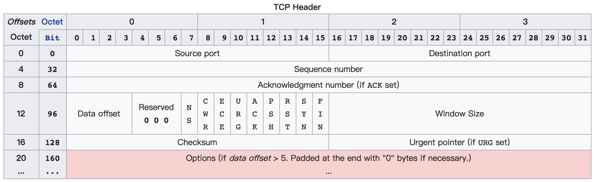

# TCP
## TCP 头部

### Source Port 和 Destination Port
Source Port 和Destination Port 分别占用16位，表示源端口号和目的端口号，用于区别主机中的不同进程。
而 IP 地址是用来区分不同的主机的，源端口号和目的端口号配合上 IP 首部中的 源 IP 地址 和 目的 IP 地址 就能唯一的确定一个 TCP 连接。
### Sequence Number
Sequence Number 用来标识从 TCP 发送方向 TCP 接收方发送的数据字节流，它表示在这个报文段中的的第一个数据字节在数据流中的序号，主要用来解决网络报乱序的问题。
在 TCP 连接中传送的每一个字节都按顺序编号，整个要传送的字节流的起始序号必须在连接建立时设置。
首部中的 Sequence Number 值指的是本报文段发送的数据的第一个字节的序号。
### Acknowledgment Number
Acknowledgment Number：32 位确认序列号包含发送确认的一端所期望收到的下一个序号，
因此，确认序号应当是上次已成功收到数据字节序号加1。
不过，只有当标志位中的 ACK 标志为1时该确认序列号的字段才有效。主要用来解决不丢包的问题。
### Offset
Offset 给出首部中 32 bit 字的数目，需要这个值是因为 Options 字段的长度是可变的。
Options 字段占 4bit（最多能表示 15 个 32bit 的的字，即 4*15=60 个字节的首部长度），因此 TCP 最多有 60 字节的首部。
没有 Options 字段，正常的长度是20字节
### TCP Flags
TCP Flags: TCP 首部中有6个标志比特，它们中的多个可同时被设置为 1 ，主要是用于操控 TCP 的状态机的。
- URG：此标志表示 TCP 包的紧急指针域有效，用来保证 TCP 连接不被中断，并且督促中间层设备要尽快处理这些数据
- ACK：此标志表示应答域有效，就是说前面所说的 TCP 应答号将会包含在 TCP 数据包中；有两个取值：0和1，为1的时候表示应答域有效，反之为0；
- PSH：这个标志位表示 Push 操作。所谓 Push 操作就是指在数据包到达接收端以后，立即传送给应用程序，而不是在缓冲区中排队
- RST：这个标志表示连接复位请求。用来复位那些产生错误的连接，也被用来拒绝错误和非法的数据包
- SYN：表示同步序号，用来建立连接。SYN 标志位和 ACK 标志位搭配使用，当连接请求的时候，SYN=1，ACK=0；连接被响应的时候，SYN=1，ACK=1；这个标志的数据包经常被用来进行端口扫描，扫描者发送一个只有 SYN 的数据包，如果对方主机响应了一个数据包回来 ，就表明这台主机存在这个端口；但是由于这种扫描方式只是进行 TCP 三次握手的第一次握手，因此这种扫描的成功表示被扫描的机器不很安全，一台安全的主机将会强制要求一个连接严格的进行 TCP 的三次握手；
- FIN：表示发送端已经达到数据末尾，也就是说双方的数据传送完成，没有数据可以传送了，发送FIN标志位的TCP数据包后，连接将被断开；这个标志的数据包也经常被用于进行端口扫描

## TCP 建立连接和断开连接

### TCP 三次握手
#### TCP 三次握手过程
- 第一次握手：建立连接。客户端发送连接请求报文段，将 SYN 位置为1，随机产生 Sequence Number 为x；然后，客户端进入 SYN_SEND 状态，等待服务器的确认；
- 第二次握手：服务器收到 SYN 报文段。服务器收到客户端的 SYN 报文段，需要对这个 SYN 报文段进行确认，设置 Acknowledgment Number 为 x+1(Sequence Number+1)；同时，自己自己还要发送 SYN 请求信息，将 SYN 位置为1，随机产生 Sequence Number 为 y ；服务器端将上述所有信息放到一个报文段（即 SYN + ACK 报文段）中，一并发送给客户端，此时服务器进入 SYN_RECV 状态；
- 第三次握手：客户端收到服务器的 SYN + ACK 报文段。然后将 Acknowledgment Number 设置为y+1，向服务器发送 ACK 报文段，这个报文段发送完毕以后，客户端和服务器端都进入 ESTABLISHED 状态，完成TCP三次握手。

#### 为什么需要三次握手？
**1.为了防止已失效的连接请求报文段突然又传送到了服务端，因而产生错误**

“已失效的连接请求报文段”的产生在这样一种情况下：client 发出的第一个连接请求报文段并没有丢失，而是在某个网络结点长时间的滞留了，以致延误到连接释放以后的某个时间才到达 server。
本来这是一个早已失效的报文段。但 server 收到此失效的连接请求报文段后，就误认为是 client 再次发出的一个新的连接请求。于是就向 client 发出确认报文段，同意建立连接。
假设不采用“三次握手”，那么只要 server 发出确认，新的连接就建立了。由于现在 client 并没有发出建立连接的请求，因此不会理睬 server 的确认，也不会向 server 发送数据。
但 server 却以为新的运输连接已经建立，并一直等待 client 发来数据。这样，server 的很多资源就白白浪费掉了。
采用“三次握手”的办法可以防止上述现象发生。例如刚才那种情况，client 不会向 server 的确认发出确认。server 由于收不到确认，就知道 client 并没有要求建立连接。
**采用三次握手防止了服务器端的一直等待而浪费资源**

**2.为了解决网络中存在延迟的重复分组的问题**

**3.这个问题的本质是, 信道不可靠, 但是通信双发需要就某个问题达成一致。
而要解决这个问题, 无论你在消息中包含什么信息, 三次通信是理论上的最小值。
所以三次握手不是 TCP 本身的要求, 而是为了满足“在不可靠信道上可靠地传输信息”这一需求所导致的**

### TCP 四次分手
#### TCP 四次分手过程
- 第一次分手：主机1（可以使客户端，也可以是服务器端），设置 Sequence Number 和 Acknowledgment Number，向主机2发送一个 FIN 报文段；此时，主机1进入 FIN_WAIT_1 状态；这表示主机1没有数据要发送给主机2了；
- 第二次分手：主机2收到了主机1发送的 FIN 报文段，向主机1回一个 ACK 报文段，Acknowledgment Number 为 Sequence Number 加1；主机1进入 FIN_WAIT_2 状态；主机2告诉主机1，我“同意”你的关闭请求；
- 第三次分手：主机2向主机1发送 FIN 报文段，请求关闭连接，同时主机2进入 LAST_ACK 状态；
- 第四次分手：主机1收到主机2发送的 FIN 报文段，向主机2发送 ACK 报文段，然后主机1进入 TIME_WAIT 状态；主机2收到主机1的 ACK 报文段以后，就关闭连接；此时，主机1等待 2MSL 后依然没有收到回复，则证明 Server 端已正常关闭，那好，主机1也可以关闭连接了。

#### 为什么需要四次分手？
TCP协议是一种面向连接的、可靠的、基于字节流的运输层通信协议。
TCP 是全双工模式，这就意味着，当主机1发出 FIN 报文段时，只是表示主机1已经没有数据要发送了，主机1告诉主机2，它的数据已经全部发送完毕了；
但是，这个时候主机1还是可以接受来自主机2的数据；当主机2返回 ACK 报文段时，表示它已经知道主机1没有数据发送了，但是主机2还是可以发送数据到主机1的；
当主机2也发送了 FIN 报文段时，这个时候就表示主机2也没有数据要发送了，就会告诉主机1，我也没有数据要发送了，之后彼此就会愉快的中断这次 TCP 连接。

- FIN_WAIT_1: 这个状态要好好解释一下，其实 FIN_WAIT_1 和 FIN_WAIT_2 状态的真正含义都是表示等待对方的 FIN 报文。而这两种状态的区别是：FIN_WAIT_1 状态实际上是当 SOCKET 在 ESTABLISHED 状态时，它想主动关闭连接，向对方发送了 FIN 报文，此时该 SOCKET 即进入到 FIN_WAIT_1 状态。而当对方回应 ACK 报文后，则进入到 FIN_WAIT_2 状态，当然在实际的正常情况下，无论对方何种情况下，都应该马上回应 ACK 报文，所以 FIN_WAIT_1 状态一般是比较难见到的，而 FIN_WAIT_2 状态还有时常常可以用 netstat 看到。（主动方）
- FIN_WAIT_2：实际上FIN_WAIT_2 状态下的 SOCKET，表示半连接，也即有一方要求 close 连接，但另外还告诉对方，我暂时还有点数据需要传送给你( ACK 信息)，稍后再关闭连接。（主动方）
- CLOSE_WAIT：这种状态的含义其实是表示在等待关闭。怎么理解呢？当对方 close 一个 SOCKET 后发送 FIN 报文给自己，你系统毫无疑问地会回应一个 ACK 报文给对方，此时则进入到 CLOSE_WAIT 状态。接下来呢，实际上你真正需要考虑的事情是察看你是否还有数据发送给对方，如果没有的话，那么你也就可以 close 这个 SOCKET，发送 FIN 报文给对方，也即关闭连接。所以你在 CLOSE_WAIT 状态下，需要完成的事情是等待你去关闭连接。（被动方）
- LAST_ACK: 这个状态还是比较容易好理解的，它是被动关闭一方在发送 FIN 报文后，最后等待对方的 ACK 报文。当收到 ACK 报文后，也即可以进入到 CLOSED 可用状态了。（被动方）
- TIME_WAIT: 表示收到了对方的 FIN 报文，并发送出了 ACK 报文，就等 2MSL 后即可回到 CLOSED 可用状态了。如果 FINWAIT1 状态下，收到了对方同时带 FIN 标志和 ACK 标志的报文时，可以直接进入到 TIME_WAIT状态，而无须经过 FIN_WAIT_2状态。（主动方）
- CLOSED: 表示连接中断。
